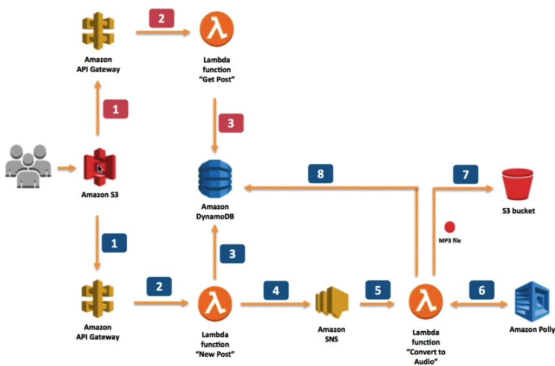

# Python project to create an AWS Stack with dynamodb, Lambda, S3 and Polly Service #

## Description ##
A simple python3 project to create a complete stack using a RESTFul API gateway that handles a GET and a POST function based on Lambda.  

The stack creates an S3 static website front end to enter some text and select a language from one of the supported Polly transcriber language modules.

The text is sent to the API gateway and then to the Lambda function to process asynchronously.
Once the mp3 for the submitted text is ready, user can play the file from the website.

The API GET function allows a search of all available transcriptions.
### Tutorial based approach and coding ###
Wanted to make this as easy to follow as possible for anyone starting out learning AWS services and python. The scripts are numbered sequences to make it easy to follow. When it comes to API gateway and IAM, AWS automates a lot of configuration behind the scene which is difficult to find even in AWS API documentation. CORS is one such setup.

The scripts for API gateway try to add some examples and documents to help understand the concepts.
## Architecture ##

### AWS Components used ###
* DynamoDB
* SNS
* S3
* Lambda
* IAM

## Prerequisites ##
* python3 
* boto3 library
* bash shell
* AWS programmatic access configured with Accesskey and Secretkey in .aws folder
* python3 should be available via shell PATH

## Using ubuntu 18.04 to host the prerequisites ##
```
sudo apt update -y
sudo apt install software-properties-common -y
sudo add-apt-repository ppa:deadsnakes/ppa
sudo apt install python3.7 -y
apt install python3-pip -y
pip3 install boto3
sudo apt-get install awscli -y
```

## Deploying the stack ##
Edit 00_env_vars.sh file to adjust the default settings for table name, api name and other parameters.
```
#!/bin/bash
# This is the global environment file
# for our Polly demo

# USE Absolute path for PROJECT DIR
export PROJECT_DIR='/home/username/polly-project'
export LOG_DIR='logs'
export LOG_FILE='app-deployment.log'

# dynamodb vars
export REGION='us-east-1'
export TABLE_NAME='PollyProject'

#S3
export BUCKET_IN='user-pollybucket-in'
export BUCKET_OUT='user-pollybucket-out'

#SNS
export TOPIC_NAME='new_polly_events'

#IAM
export LAMBDA_POLICY='user-lambda-policy'
export LAMBDA_ROLE='user-lambda-role'

#API GATEWAY
export API_NAME='ServerLessPollyAPI'
export API_STAGE_NAME='development'
```
Once env vars file is updated, source that file to ensure the variables are exported
```
source ./00_env_vars.sh
```

To deploy the stack to AWS, run the deploy.sh command from bash shell
```
> ./deploy.sh
```
At this point, the script should run for 2-3 minutes to create the stack. Login to your AWS console to monitor activities for each components.

You can also tail the log file in $LOG_DIR/$LOG_FILE
If there are any errors in creating the resources, the log file and install script would indicate where the error occurred.

## Accessing the Application ##
Once the deploy script finishes, the application should be available at
```
https://$BUCKET_IN.s3-website-us-east-1.amazonaws.com/index.html
```
Enter some text in the top box to transcribe to mp3 and hit the submit button. A PostId would be displayed in a few seconds but may not be in ready state for playing back.

In the search button below, enter ‘*’ and click submit. The screen should update with the processed data list. You can click on the player button to play back the mp3.

## Destroying the Stack ##
Run destroy_stack.sh script to delete the entire stack. All output would go to the Logfile as before and can be used for debugging.
```
./destroy_stack.sh
```
You can also use the AWS console to verify if all clean up is completed.

## Stuff to add ##
Test scripts are in progress.

### Credits to be mentioned ###
The lambda text to mp3 polly function is from a course I took from acloudguru.com, but you can also find similar functions on AWS documentation.


